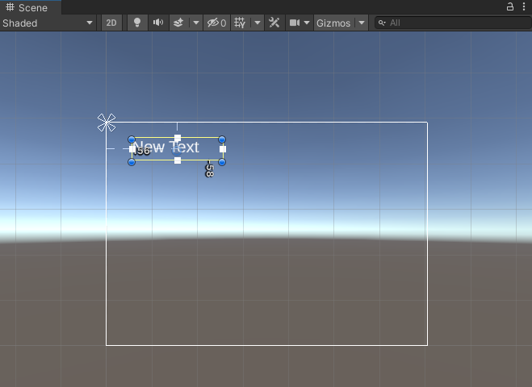

Tu peux aussi cliquer sur **2D** en haut de la vue Scene pour voir le texte.

Clique sur le **Canvas** contenant ton TextMeshPro dans la fenêtre Hierarchy, assure-toi qu'il est actif, et utilise <kbd>Shift</kbd>+<kbd>F</kbd> pour centrer la vue dessus.

Clique sur ton **UI Object** (TextMeshPro, Panel, Button) dans la fenêtre Hierarchy, puis fais-le glisser jusqu'à la position souhaitée dans la vue Scene.

{:max-width=400px;}

Clique à nouveau sur **2D** pour revenir au mode 3D. Tu peux aussi vouloir désactiver Canvas s'il a également été désactivé précédemment.

**Astuce :** lorsque tu positionnes des boutons dans la vue 2D, assure-toi que tu as sélectionné le bouton, et pas seulement son objet enfant texte.
